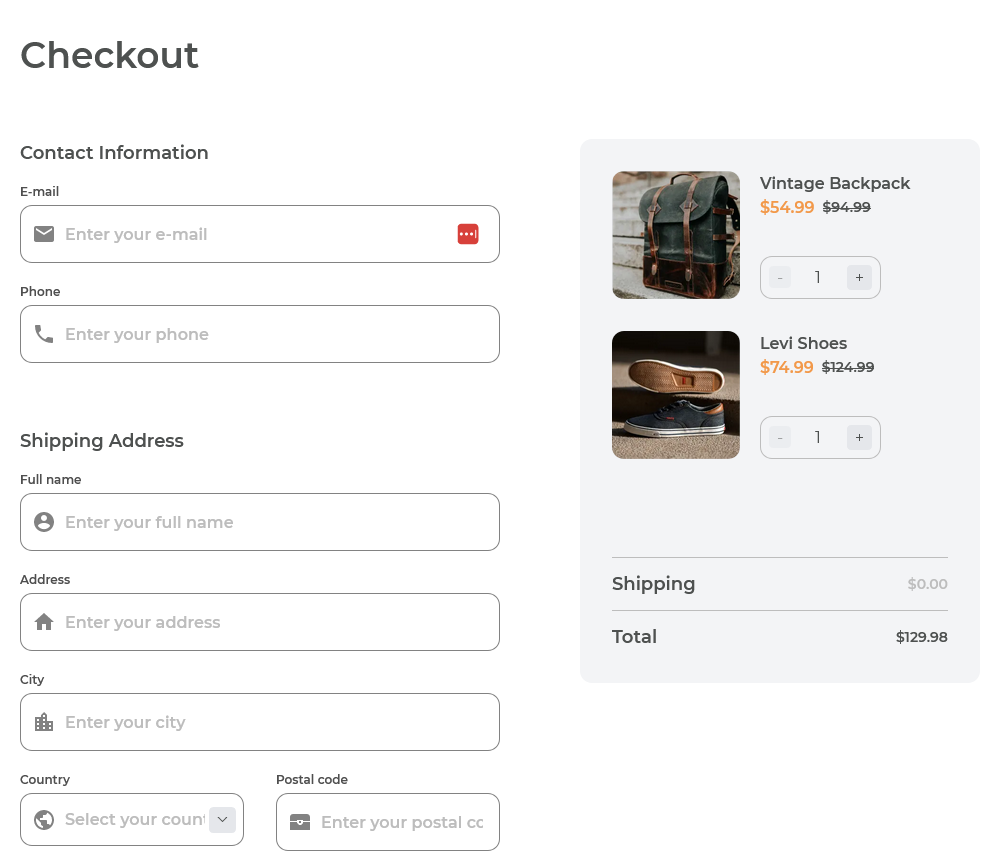

<!-- Please update value in the {}  -->

<h1 align="center">Checkout Page - Dev Challenges</h1>

<div align="center">
   Solution for a challenge from  <a href="http://devchallenges.io" target="_blank">Devchallenges.io</a>.
</div>

<div align="center">
  <h3>
    <a href="https://checkout-page-azure.vercel.app/">
      Demo
    </a>
    <span> | </span>
    <a href="https://github.com/Danak-UY/checkout-page">
      Solution
    </a>
    <span> | </span>
    <a href="https://devchallenges.io/challenges/0J1NxxGhOUYVqihwegfO">
      Challenge
    </a>
  </h3>
</div>

<!-- TABLE OF CONTENTS -->

## Table of Contents

- [Overview](#overview)
- [Built With](#built-with)
- [Features](#features)
- [How to user](#how-to-use)
- [UserStories](#user-stories)

<!-- OVERVIEW -->

## Overview



### Built With

<!-- This section should list any major frameworks that you built your project using. Here are a few examples.-->

- [VueJs](https://vuejs.org/) - JS Framework
- [TailwindCSS](https://tailwindcss.com/) - CSS Styling
- [Material Icons](https://developers.google.com/fonts/docs/material_icons) - Form Icons

## Features

<!-- List the features of your application or follow the template. Don't share the figma file here :) -->

This application/site was created as a submission to a [DevChallenges](https://devchallenges.io/challenges) challenge. The [challenge](https://devchallenges.io/challenges/0J1NxxGhOUYVqihwegfO) was to build an application to complete the given user stories.

## How To Use

To clone and run this application, you'll need [Git](https://git-scm.com) and [Node.js](https://nodejs.org/en/download/) (which comes with [npm](http://npmjs.com)) installed on your computer. From your command line:

```bash
# Clone this repository
$ git clone https://github.com/Danak-UY/checkout-page

# Install dependencies
$ npm install

# Run the app
$ npm run dev
```

## Acknowledgements

<!-- This section should list any articles or add-ons/plugins that helps you to complete the project. This is optional but it will help you in the future. For exmpale -->

- [Squoosh](https://squoosh.app/) - Optimize images with webp

## User Stories

- I can see a page following the given design
- I can input email, phone, full name, address, city, country, and postal code
- I can input the number of items
- I can select at least 3 countries from the dropdown
- When I click submit button or press enter, I can see a warning if validation fails
- When I click submit button or press enter, I can see a successful alert if validation succeeds
